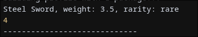
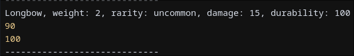
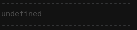

# Лабораторная работа №3. Продвинутые объекты в JavaScript

## Инструкции по запуску
Для запуска я предлагаю использовать скрипт *run.sh*, который
автоматически, при помощи пакетного менеджера GNU Guix, создаёт
необходимую для запуска среду, и запускает скрипт.

## Цели, задачи, условие, водка

- Познакомиться с классами и объектами в JavaScript, научиться создавать классы, использовать конструкторы и методы, а также реализовать наследование.
- Создайте консольное приложение, моделирующее систему инвентаря, где можно добавлять предметы, изменять их свойства и управлять ими.
- Русская

## Краткая документация

### Класс `Item`
Базовый класс для представления предмета с характеристиками:
- **Поля**:
  - `name` (строка) - название предмета.
  - `weight` (число) - вес предмета.
  - `rarity` (строка) - редкость (`common`, `uncommon`, `rare`, `legendary`).

- **Методы**:
  - `getInfo()`: Возвращает строку с информацией о предмете.
  - `setWeight(newWeight)`: Изменяет вес предмета.

### Класс `Weapon` (наследуется от `Item`)
Класс для представления оружия с дополнительными свойствами:
- **Поля**:
  - `damage` (число) - урон оружия.
  - `durability` (число, 0-100) - прочность.

- **Методы**:
  - `use()`: Уменьшает прочность на 10 единиц (но не ниже 0).
  - `repair()`: Восстанавливает прочность до 100.
  - `getInfo()`: Переопределяет метод `Item`, добавляя информацию об уроне и прочности.

### Функциональные конструкторы
Альтернативная реализация через функции:
- `ItemFunc`: Аналог класса `Item`.
- `WeaponFunc`: Аналог класса `Weapon` с наследованием от `ItemFunc`.

---

## Примеры использования

### 1. Создание предмета и изменение веса
```javascript
const sword = new Item("Steel Sword", 3.5, "rare");
console.log(sword.getInfo()); // "Steel Sword, weight: 3.5, rarity: rare"
sword.setWeight(4.0);
console.log(sword.weight); // 4.0
```

**Скриншот вывода консоли**:


---

### 2. Использование оружия и восстановление прочности
```javascript
const bow = new Weapon("Longbow", 2.0, "uncommon", 15, 100);
console.log(bow.getInfo()); // "Longbow, weight: 2.0, rarity: uncommon, damage: 15, durability: 100"
bow.use();
console.log(bow.durability); // 90
bow.repair();
console.log(bow.durability); // 100
```

**Скриншот вывода консоли**:


---

### 3. Работа с опциональной цепочкой
```javascript
const inventory = {
    items: [new Item("Potion", 0.5, "common"), null],
};
console.log(inventory.items?.[1]?.getInfo()); // undefined (второй элемент null)
```

**Скриншот вывода консоли**:


## Ответы на контрольные вопросы

- **`this` в методах класса** указывает на экземпляр объекта, созданный из класса.  
- **Модификатор `#`** делает поле приватным — оно доступно только внутри класса.  
- **Классы** — это фешен над функциями-конструкторами с более кьюти синтаксисом и строгими правилами (например, вызов без `new` даст ошибку). **Функции-конструкторы** используют `prototype` для методов и могут работать без `new`.
