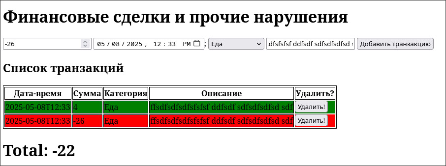

# Отчёт по лабораторной работе: Учёт личных финансов на JavaScript

## Цель работы
Ознакомление с основами взаимодействия JavaScript с DOM-деревом на примере веб-приложения для учёта личных финансов.

---

## Структура проекта

```
project-root/
├── index.html           # Главная HTML-страница
├── style.css            # Стили для страницы
└── src/
    ├── index.js         # Точка входа, инициализация логики
    ├── transactions.js  # Хранение и работа с массивом транзакций
    ├── ui.js            # Работа с DOM (таблица, форма, удаление)
    └── utils.js         # Вспомогательные функции (дата, ID, сумма)
```

---

## Шаги реализации

### Шаг 1. Настройка проекта
Проект структурирован по модулям:
- `index.js` подключается с `type="module"` в HTML.
- Все модули разделены по функциям: данные (`transactions.js`), DOM (`ui.js`), утилиты (`utils.js`).

### Шаг 2. Представление транзакции
Каждая транзакция имеет поля:
- `id` — уникальный идентификатор,
- `date` — дата и время,
- `amount` — сумма,
- `category` — категория,
- `description` — описание.

### Шаг 3. Отображение транзакций
В HTML реализована таблица с колонками:
- Дата и Время,
- Категория,
- Описание (первые 4 слова),
- Действие (кнопка Удалить).

### Шаг 4. Добавление транзакции
Форма позволяет добавить транзакцию. При добавлении:
- Данные берутся из полей формы.
- Создаётся объект и добавляется в массив.
- Строка добавляется в таблицу (зелёная при положительной сумме, красная при отрицательной).

### Шаг 5. Управление транзакциями
Удаление реализовано через делегирование событий:
- Слушатель кликов висит на `<table>`.
- Кнопка удаления содержит `id`.
- После удаления: строка и объект удаляются.

### Шаг 6. Подсчёт суммы
Функция `calculateTotal()`:
- Суммирует все значения `amount`.
- Отображает в `#total-amount`.

### Шаг 7. Полное описание транзакции
При клике по строке отображается полное описание транзакции в отдельном параграфе (`#full-description`).

### Шаг 8. Форма добавления
Добавлена форма с `input` и `select`.
Поля проверяются через `required`.

---

## Показуем



---
## Контрольные вопросы

### 1. Каким образом можно получить доступ к элементу на веб-странице с помощью JavaScript?
С помощью методов DOM, таких как:
```js
document.getElementById('id');
document.querySelector('.class');
```

### 2. Что такое делегирование событий и как оно используется для эффективного управления событиями на элементах DOM?
Делегирование — это установка обработчика на родительский элемент и проверка цели события внутри него. Это удобно, когда элементы добавляются динамически. В нашем проекте обработчик навешивается на `table`, а не на каждую кнопку удаления отдельно.

### 3. Как можно изменить содержимое элемента DOM с помощью JavaScript после его выборки?
```js
const el = document.getElementById('example');
el.textContent = 'Новый текст';
el.innerHTML = '<b>Жирный текст</b>';
```

### 4. Как можно добавить новый элемент в DOM-дерево с помощью JavaScript?
```js
const row = document.createElement('tr');
row.innerHTML = '<td>Содержимое</td>';
document.querySelector('tbody').appendChild(row);
```

---

## Вывод
Приложение успешно реализует все функции учёта транзакций: добавление, удаление, отображение и подсчёт. Применяются современные подходы модульного JS, взаимодействие с DOM, делегирование событий и валидация формы.
