# Table of Contents

1.  [Цель работы](#org87caf67)
2.  [Инструкции по запуску проекта](#orgec60d74)
3.  [Ход работы](#org986b491)
    1.  [Подготовка среды](#orgefc5846)
        1.  [Установка текстового редактора](#org41dc030)
        2.  [Установка `Node.js`](#org28e4690)
        3.  [Открыть консоль `Devtools` в браузере](#org1c06539)
    2.  [Выполнение JavaScript кода в браузере](#org4432b0f)
    3.  [Создаем первую HTML-страницу с JavaScript!](#org00475ea)
        1.  [Подключаем внешний JavaScript файл](#org992ac70)
    4.  [Работа с типами данных](#org94c0c06)
        1.  [Объявление переменных и работа с типами данных](#org1098cc4)
4.  [Отвечаю на контрольные вопросы!](#org7954f3e)
5.  [Использованные источники](#orgcbe1f1f)

# Цель работы

Ознакомиться с основами JavaScript, научиться написанию и выполению
кода, изучить базовые конструкции языка.

# Инструкции по запуску проекта

Для запуска проекта, скачайте репозиторий любым удобным методом, и
запустите файл [`index.html`](index.html).

# Ход работы

## Подготовка среды

### Установка текстового редактора

Для выполнения работы я использую <del>текстовый редактор</del> универсальный
интерпретатор языка Emacs Lisp с функциями текстового редактора GNU
Emacs, установленный мной через пакетный менеджер GNU Guix. Установка
выполняется при помощи [моего конфигурационного файла](https://git.disroot.org/lesikedelweiss/dotfiles) и команды [`guix
home`](https://guix.gnu.org/manual/devel/en/html_node/Invoking-guix-home.html).

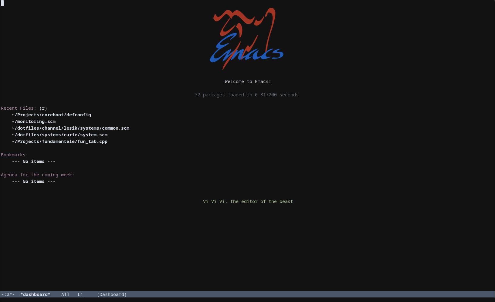

### Установка `Node.js`

Для установки `Node.js` использовалась команда [`guix shell`](https://guix.gnu.org/manual/devel/en/html_node/Invoking-guix-shell.html) с
прикреплённым к этой работе файлом манифеста.

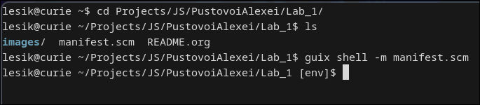

### Открыть консоль `Devtools` в браузере

Для открытия `Devtools` используется клавиша `F12`, после чего мы
переходим в вкладку `Консоль`. Это карйне удобно, поскольку позволяет
нам работать с кодом через REPL, как в диалектах Lisp, т.е. привычном
для пользователей GNU Emacs образом.

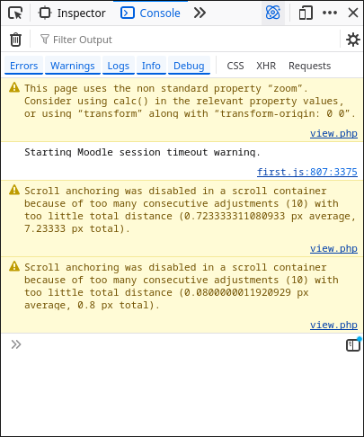

## Выполнение JavaScript кода в браузере

Как уже было обсуждено ранее, JavaScript можно выполнять через REPL в
брузере, что является удобным способом выполнения простого кода, или
тестирования каких либо функций. Воспользуемся этой возможностью, для
выполнения кода! Запишем несколько простых выражений и инструкций в
консоль!

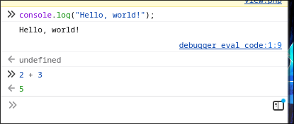

Видно, что первая введённая команда является инструкцией. Ведь так?
Она не возвращает определенное значение (но возвращает undefined), и
имеет побочный эффект (вывод в консоль).

А вторая команда является выражением, поскольку она возвращает
результат.

## Создаем первую HTML-страницу с JavaScript!

После создания файла [`index.html`](./index.html) в него был вставлен предложенный код.

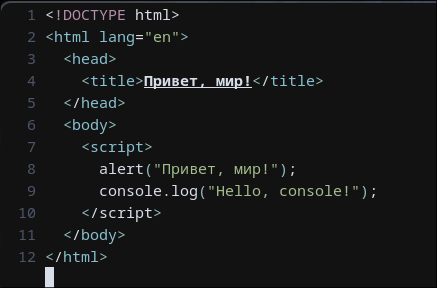

Запустим же его в браузере!

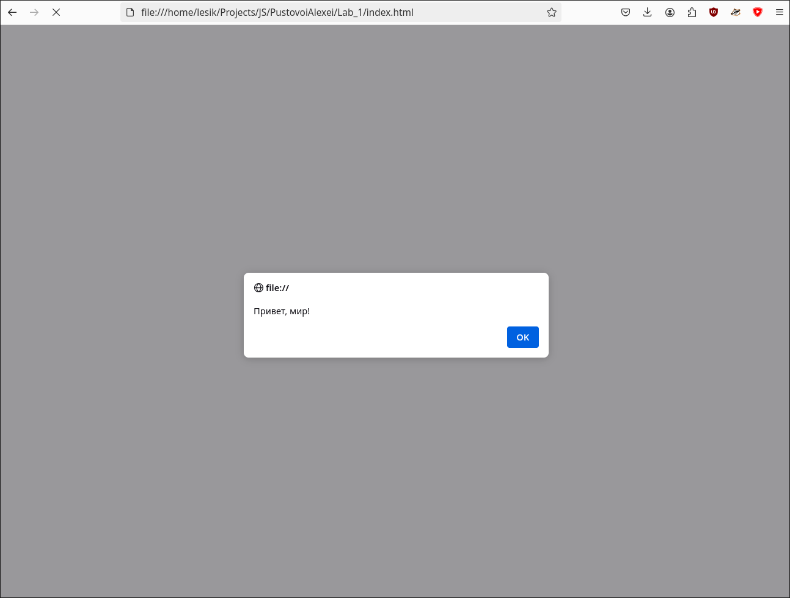

Ого-го! Вывелось окно с текстом `Привет, мир!` Это следствие
выполнения инструкции `alert()`.

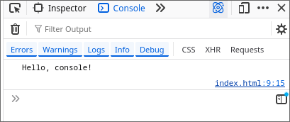

Также в консоль вывелся текст `Hello, console!`, что является
следствием выполнения инструкции `console.log()`.

### Подключаем внешний JavaScript файл

Создадим файл [`script.js`](./script.js) в который поместим предложенный в файле
лабораторной работы код.

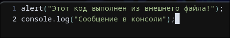

Теперь подключим этот файл в [`index.html`](index.html). Для этого добавляем тэг
`<script>`. Его можно добавлять в разных местах, но обычно это
делается или в `<head>`, или в конце `<body>`. Расположение этого тэга
влияет на то, в какой момент загрузки страницы произойдет выполнение
кода.

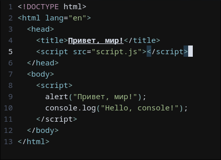

Выполним полученный код, и пронаблюдаем за результатом

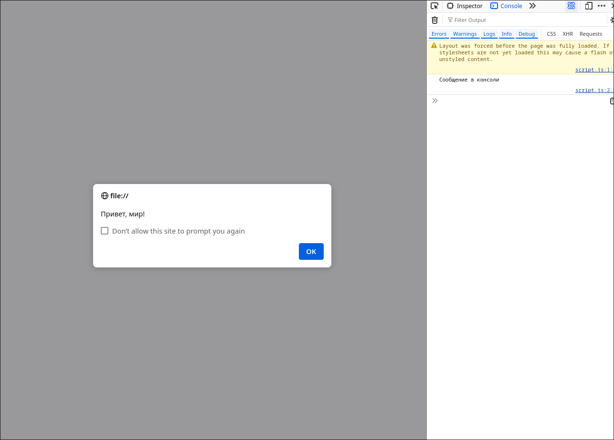
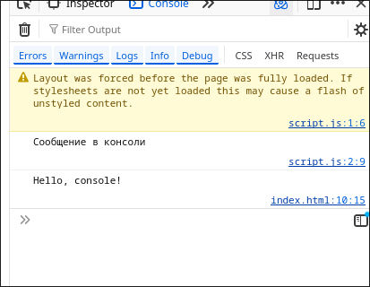

При выполнении замечаем, что сначала исполняются команды из внешнего
файла, а только потом встроенные в код. Это происходит из-за разного
местоположения тэга `<script>`.

## Работа с типами данных

### Объявление переменных и работа с типами данных

Объявим в файле [`script.js`](script.js) переменные разных типов, и выведем их в консоль:

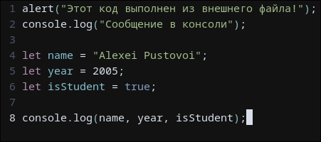

Запустим этот код в браузере!

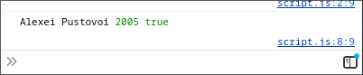

Чудо-чудное, диво-дивное! У нас получилось вывести данные, записанные
в переменных, в консоль!

Добавим предложенный в инструктаже код в наш файл.

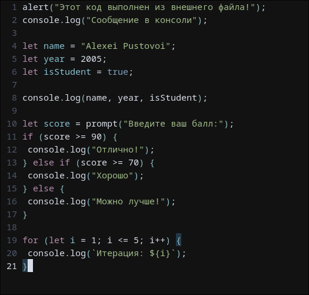

Теперь запустим его в браузере, и проанализируем результаты его
выполнения!

При запуске запросило ввод данных. Это происходит из-за выражения
`prompt()`. Заполним его числом.

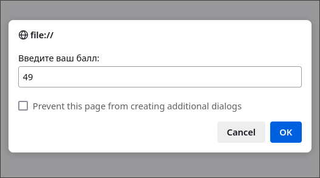

Вывело текст `Можно лучше!` и пять `Итерация {число}`. Первый текст
был выведен, согласно условиям конструкции if. Поскольку введенный
мной балл был меньше 70.

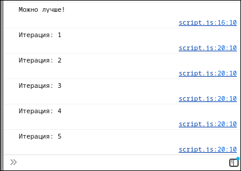

Попбробуем достичь иных возможных результатов.

При введении балла 88 выполнилось условие `score >=70`, и вывелся
текст `Хорошо`.

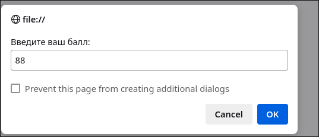
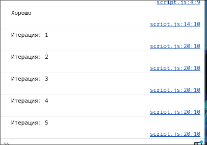

При введении балла 1337 выполнилось условие `score >= 90`, и вывелся
текст `Отлично!`.

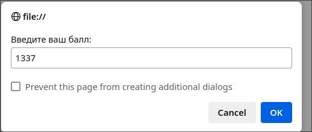
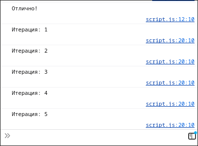

# Отвечаю на контрольные вопросы!

1.  -   Чем отличаетcя `var` от `let` и `const`?
    -   `var` определяет изменяемую переменную с глобальной областью
        видимости, то есть, она будет видна не только внутри блоков `if`
        или `for`, но и за их пределами, а также допускает
        переопределение переменной. `let` лишён фатального недостатка
        `var`, и создаёт изменяемую переменную, область видимости которой
        ограниченна блоком, в котором она определена. `const` же, в свою
        очередь, создаёт неизменяемые переменные.
2.  -   Что такое неявное преобразование типов в JavaScript?
    -   Неявное преобразование типов, это удивительное свойство, присущее
        языкам со слабой типизацией. Оно позволяет языку самостоятельно,
        без явного выражения такого желания программистом,
        приобразовывать переменные из одного типа в другой. Таким образом
        выражение `"11" + 1` вернет результат `"111"`, а `"11" - 1`
        вернёт `10`. Причиной этому служит тот факт, что в первом случае,
        JavaScript преобразует число 1 в строку, а во втором случае
        строку "11" в число.
3.  -   Как работает оператор ​=​= в сравнении с ​=​=​=?
    -   Оператор ​=​= сравнивает на равенство значения, и допускает
        приведение типов, а оператор ​=​=​=, не производит приведения типов,
        и сравнивает только идентичные объекты.

# Использованные источники

Программа нашего курса, и материалы с moodle. Вот так вот.

